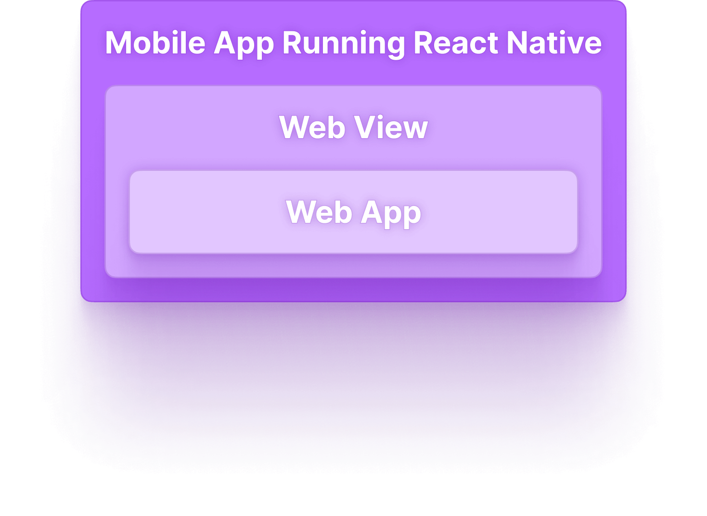
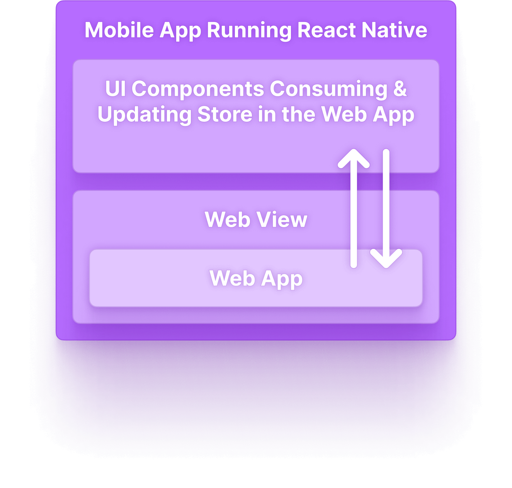
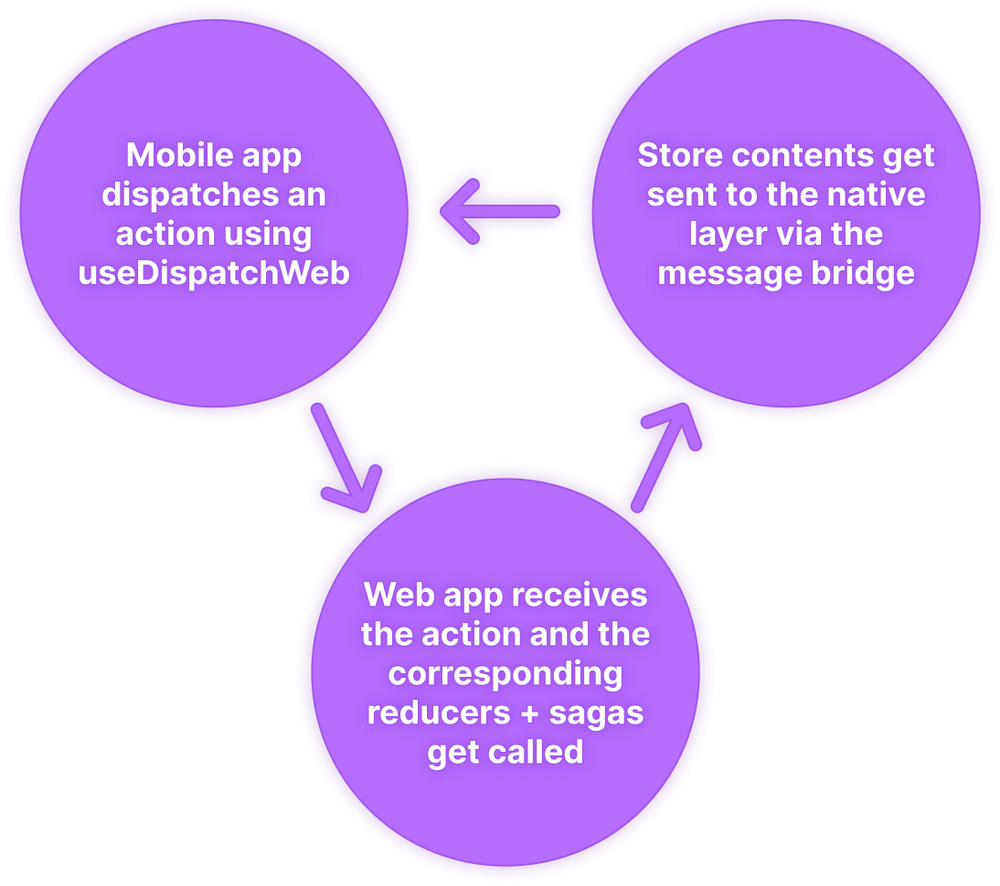
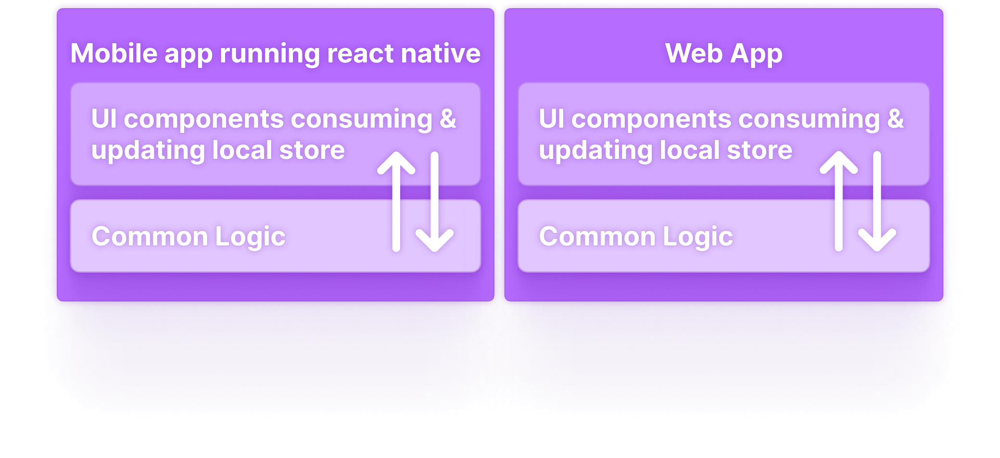

---
authors:
  - audius_eng
  - sebastian
tags: [engineering]
slug: /audius-react-native-migration
description: Audius React Native Migration
image: ./img/social-card.png
date: 2022-11-08T00:00
---

# Audius React Native Migration

When we first built the Audius Music mobile app, we chose to simply create a
thin React Native WebView wrapper around our already existing web app. It
allowed us to go to market quickly and provide a full-featured mobile experience
with minimal development effort.

But over time, it became clear that the WebView-based mobile experience was not
ideal for users in a few different ways.


<!--truncate-->

Another benefit was that new features only needed to be implemented for one
platform and would then be available across web, iOS, and Android. Also, the
crypto libraries that we depended on were immature and difficult, if not
impossible, to use outside of a web environment.

At the time, using a WebView was definitely the right choice.

But over time, it became clear that the WebView-based mobile experience was not
ideal for users in a few different ways:

- Performance was lacking, especially for animations and transitions, which were
  capped at 30 frames per second
- Many native gestures were not supported
- Mobile navigation was directly tied to the web routing structure, so changing
  between screens often meant losing a previous navigation context



The React Native WebView approach also presented some difficulties for
developers:

- For certain features, communicating with the native layer was necessary and
  required an asynchronous and potentially slow message passing bridge
- Running the app locally required bundling and serving the web app before
  running the React Native layer

## 🚚 Migrating to React Native

To provide users and developers with a better experience, we decided to remove
the WebView and build a fully React Native mobile application.

However, we wanted to avoid the maintenance burden of two completely separate
apps, so we set a goal of sharing as much code between web and mobile as
possible. This presented a challenge and required careful consideration at every
step.

It was not possible to reuse our web React components in React Native so
rewriting at least the UI layer was required, but much of the state management
and business logic could be shared.

## Incremental migration

We decided to perform the migration in two phases so that we could reap some
benefits early.

Phase 1 was the process of implementing the user interface in React Native while
still using the web app as the state management layer (using redux and
redux-sagas). This postponed having to migrate much of the complex business
logic and would already achieve 60fps animations, better gesture support, and
improved UI performance.

Phase 2 was the process of repurposing all the state management & business logic
existing in the web app to be platform-agnostic and to run in React Native.
Having platform-agnostic business logic would allow the WebView to be removed
entirely and both the mobile and web apps to run on top of the same business
logic.

‍

## 🪜 Preliminary step - Monorepo

One of the first changes that made the migration more efficient was the move to
an audius-client monorepo that contains both the Audius web client and the
Audius mobile app. Combining these repositories reduced overhead as we migrated
individual screens and features to React Native. We no longer had to make
separate pull requests for a single feature!

## ☝️ Phase 1 - React Native UI

The plan for Phase 1 was to incrementally implement screens and features using
React Native while keeping the WebView around as the state management layer. The
WebView did not even need to be rendered (in fact we ended up using react-nil to
render nothing) - we only cared about the contents of the redux store and the
corresponding sagas and reducers.

A problem that was immediately apparent was that using the existing message
passing bridge to support every new React Native component's data requirements
would be extremely tedious, error-prone, and thrown away once we began Phase 2.
We needed a pattern that would make it easy for React Native components to
interact with the redux store in the web app. The breakthrough came with
useSelectorWeb and useDispatchWeb.

```code js
export const ProfileScreen = () => {
  const dispatchWeb = useDispatchWeb()
  const profile = useSelectorWeb(profile)
 const handleRefresh = useCallback(() => {
    if (profile) {
      const { handle, user_id } = profile
      dispatchWeb(fetchProfile(handle, user_id))
    }
  }, [profile, dispatchWeb])
  ...
}
```



These custom hooks mimicked useSelector and useDispatch but instead of
interacting with the local redux store, they "reached into" the redux store in
the web app layer. But because useSelectorWeb needed to be synchronous, sending
and receiving an asynchronous message over the message bridge to the web layer
to get the contents of the store was not an option.

Instead, we configured the web app store to sync a subset of its state to the
native layer via the message bridge. The native layer would receive the sync
message and put the data into its own store. Now, useSelectorWeb could simply
run selectors against this subset of state and the components could
transparently access data from the web app! Check out the code here

:::info

💡 One downside of useSelectorWeb was that reference equality was lost when the
store was synced from web to mobile. This meant the redux couldn’t automatically
prevent rerenders. To deal with this, we had to be extra careful with our
selectors and use custom equality checks

:::

useDispatchWeb was simpler because it could be asynchronous. It dispatched a
message to the web app which would then dispatch the same action on its redux
store. After the store update, the state sync would run and the data would be
sent back to the native layer, completing the cycle.

In this way we created a completely transparent interface for React Native
components to access a redux store that lived inside the Audius web app inside a
WebView. This made writing the new UI components a breeze!

## ✌️ Phase 2 - Full React Native

The plan for Phase 2 was to remove the WebView entirely by running the common
business logic directly in React Native. This presented another big challenge:



The logic present in the web app was only implemented to support a web
environment and contained a lot of complex libraries and crypto-specific
functions for interacting with Ethereum, Solana, the Wormhole Bridge, the Audius
storage protocol, etc. To run it in a React Native environment meant refactoring
much of it to accept platform dependencies as arguments. Some things that had to
be updated:

- Our crypto wallet / user authentication system Hedgehog
- The existing shared business logic module libs which has since been repurposed
  as the @audius/sdk
- Any code in the web app that referenced window, process.env, and a variety of
  other browser specific APIs

Feeling inspired by this piece, we also decided to move all the shared code into
a common directory on which both the mobile and web apps would depend. This
would finally sever the mobile -> web dependency!



As the redux sagas were made platform-agnostic and placed in common we imported
and ran them in the native mobile layer. This allowed us to remove the state
coming from the WebView and rely directly on the new local redux state by simply
replacing useSelectorWeb and useDispatchWeb with their normal useSelector and
useDispatch counterparts.

When no more components depended on the WebView, it was finally time to delete
it and celebrate!

## 📊 Results

As a result of the migration, the mobile app is no longer limited in performance
by running inside a browser. The mobile experience is noticeably smoother, with
fewer animation/transition hiccups and much more “native” feel.

The removal of the WebView also enabled us to improve the navigation structure
by allowing each main screen to have its own stack context, similar to apps like
Twitter and Instagram. In addition, the migration dramatically improved
developer experience. Developers now only have to run a single app to develop
locally. It’s much easier and less error prone! Checkout the readme.

‍The move to React Native was a long and tedious process, but the results speak
for themselves!
