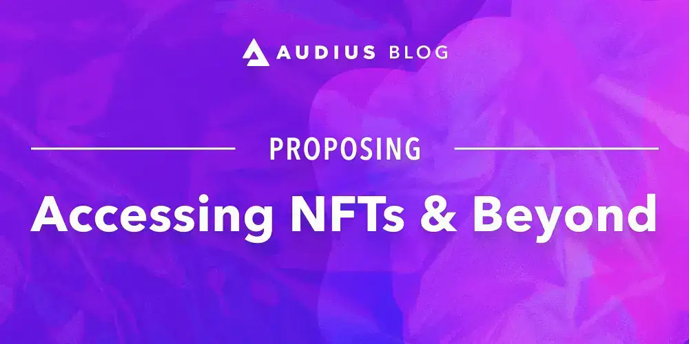

---
authors:
  - audius_eng
tags: [engineering]
slug: /proposing-audio-rewards-on-solana
description: Proposing $AUDIO Rewards on Solana
image: ./img/social-card.png
date: 2022-02-07T00:00
---

# Proposing $AUDIO Rewards on Solana

Introduction We propose the introduction of a fully decentralized incentive
system for the Audius Protocol, known as
‘$AUDIO Rewards’. This system allows
artists and fans on Audius to complete challenges in exchange for small amounts
of $AUDIO, leveraging the high throughput and low costs of Solana to put more
$AUDIO
in the hands of the grassroots community than ever before.

<!--truncate-->

$AUDIO Rewards is the culmination of many months of team engineering effort,
building upon existing entities in the Audius ecosystem and adding new ones –
including a bridged SPL $AUDIO token on Solana. The engineering work completed
for Rewards establishes key technical infrastructure and paves the way for
monetization development, though it itself is not monetization – it is a system
designed to provide small amounts of $AUDIO to many users and incentivize top of
funnel activity.

This document provides a high level overview of the Rewards system, funding
process, and governance proposals required to enact it. As a community member,
it is up to you to decide through your votes whether or not this should be
introduced to the network.

## 📋 Specification

### SPL Token

Currently, Audius has nearly 400,000 registered accounts on-chain, all of whom
are eligible to complete multiple challenges and earn $AUDIO rewards. Due to the
latency and costs associated with Ethereum transactions, distributing rewards at
this scale would be impossible with our existing ERC-20 $AUDIO token. For this
reason, we’ve opted to bridge the existing Ethereum token onto Solana as
[SPL $AUDIO](https://explorer.solana.com/address/9LzCMqDgTKYz9Drzqnpgee3SGa89up3a247ypMj2xrqM),
using the [Portal Token Bridge](https://portalbridge.com/). $AUDIO Rewards uses
this SPL token internally, with the Audius.co client app making the distinction
between the two tokens as seamless as possible.

The Portal Token Bridge is a bi-directional bridge, allowing users to freely
convert assets between multiple chains. While a deep dive is beyond the scope of
this document, users are able to use the bridge to freely bridge between ETH and
SPL $AUDIO.

Solana already processes hundreds of thousands of Audius transactions every day,
supporting key protocol functionality such as listen counts. Establishing an SPL
token is the next major step in the protocol’s integration with the Solana
ecosystem, enabling fast and cheap transfers of $AUDIO for $AUDIO Rewards and
future monetization efforts.

## 👩‍💻 Solana Programs

At the heart of $AUDIO Rewards are two new Solana programs: **ClaimableTokens**
and **RewardsManager**. We partnered with Kudelski security to rigorously audit
and test these programs for security vulnerabilities.

[Kudelski Security Assessment for Audius Protocol](https://cdn.prod.website-files.com/6024b69839b1b755528798ea/6201872afb297b3955e303aa_Audius%20-%20Security%20Assessment%20for%20Audius%20Protocol%20v1.1.0.pdf)

Additionally, we also conducted a peer audit of both programs with developers
from [Alles](https://github.com/allesctf) - these individuals were extremely
helpful, and we’d like to thank @A2nkf and @CherryWorm for their careful
scrutiny.

### ClaimableTokens

[ClaimableTokens](https://github.com/AudiusProject/audius-protocol/tree/master/solana-programs/claimable-tokens)
is a Solana program that allows users to custody SPL $AUDIO tokens using their
existing Ethereum based Audius identity. By leveraging secp_2561k1 signature
recovery, an Audius Protocol user can prove their ownership of a Claimable Token
Solana account and control their funds. Importantly, ClaimableToken accounts can
be derived deterministically from a user’s existing Audius eth wallet, allowing
the Audius Protocol to establish the correct accounts for users behind the
scenes.

### Rewards Manager

[RewardsManager](https://github.com/AudiusProject/audius-protocol/tree/master/solana-programs/reward-manager)
is a Solana Program responsible for disbursing SPL $AUDIO to a user’s Claimable
Token account upon receipt of challenge completion from a consensus of Discovery
Nodes. The program is also responsible for maintaining a list of valid Discovery
Nodes (i.e. registered with the existing Eth based
[ServiceProviderFactory](https://github.com/AudiusProject/audius-protocol/blob/master/eth-contracts/contracts/ServiceProviderFactory.sol)
contract), which are trusted to attest to a user’s completion of a challenge.

‍

## 🏦 Funding $AUDIO Rewards

With the community’s approval, we propose as a starting point to fund the $AUDIO
Rewards system by adjusting the annual funding rate from 7% to 6%, allocating
the extra 1% towards the rewards system.

Given that the staking system has been running for over a year, we additionally
propose to set a new basis for the annual rewards inflation at 1,070,000,000
tokens, increased from the existing 1,000,000,000. Under 6% inflation with the
new basis, this equates to 64,200,000 tokens issued annually versus 70,000,000
annually today.

As we all learn more about how these rewards programs perform, we can adjust
these parameters further in the future.

These tokens will be distributed weekly as part of the funding rounds and
automatically transferred to the Rewards Manager via a new Ethereum contract,
the
[EthRewardsManager](https://github.com/AudiusProject/audius-protocol/blob/master/eth-contracts/contracts/EthRewardsManager.sol).
Described in more detail below in the Governance section, the EthRewardsManager
is responsible for receiving funds from the ClaimsManager contract via the
governable communityPoolAddress, and then transferring those funds cross-chain
to the Solana RewardsManager program via the Portal Token Bridge.

## 🔐 Securing the $AUDIO Rewards System

> Wouldn’t it be great if we were all 🎶just here for the music 🎶?

‍

‍

‍

‍

‍

While we’re incredibly excited to get more rewards into the hands of our amazing
community, the network also needs to be prepared to handle the malicious
activity this system is likely to attract. There are a range of potential attack
vectors to consider - from simple attacks, such as users controlling multiple
accounts via scripts, to more sophisticated operations such as
[Click Farms](https://ppcprotect.com/blog/ad-fraud/what-is-a-click-farm/) and
[Botnets](https://securityintelligence.com/articles/what-is-botnet-attack/). To
combat these exploits, we’re proposing a new off-chain service - the **Anti
Abuse Oracle** - designed to safeguard the integrity of the rewards system in a
decentralized manner.

Community operated Discovery Nodes and Anti Abuse Oracles work together to
protect the $AUDIO Rewards system. Both node types are responsible for attesting
that a user has completed a challenge; this attestation takes the form of an
[Secp256k1 signature](https://river.com/learn/terms/s/secp256k1/), produced by
signing a string that uniquely identifies both user and challenge. A Discovery
Node will only attest to a challenge once its view of on-chain actions indicates
that the challenge is complete. An Anti Abuse Oracle takes as input the user’s
handle, some challenge-specific metadata, and derives a score that represents
the likelihood that the given user is abusive. The oracle will only produce an
attestation if the score is above a certain threshold; otherwise, it will either
reject the user or prompt the application to request more information.

The criteria used by the Anti Abuse Oracle to identify malicious behavior are
kept intentionally opaque. If these implementation details were widely known,
bad actors would have a significant advantage in exploiting the rewards system.
This game of cat and mouse is seen frequently in popular social media services
like [Reddit](https://jungletopp.com/reddit-algorithm/) and
[Instagram](https://sproutsocial.com/insights/instagram-algorithm/), where users
attempt to reverse-engineer and game the ever-changing algorithms,
[sometimes to great effect](https://www.sciencedirect.com/science/article/abs/pii/S8755461520300335).

We believe the rewards system is best secured by the oracle internals remaining
unknown to the general public, and the oracle operation and continued private
development managed by a decentralized group of community stewards, chosen
transparently via community governance.

With the mandate of the community, we propose to deploy a new contract –
EthRewardsManager – which will register the Ethereum addresses of three oracles
at launch. These three initial nodes will be operated by known, trusted protocol
participants:
[Open Audio Foundation](https://dashboard.audius.org/#/services/operator/0xe5b256d302ea2f4e04B8F3bfD8695aDe147aB68d),
[Endline Network](https://dashboard.audius.org/#/services/operator/0x528D6Fe7dF9356C8EabEC850B0f908F53075B382),
and
[Creator Seed](https://dashboard.audius.org/#/services/operator/0xf13612C7d6E31636eCC2b670d6F8a3CC50f68A48).
The community will have the opportunity to ratify the inclusion of the
EthRewardsManager in the contracts registry via the established governance
process (more on that in the Governance section).

Once EthRewardsManager is deployed, Discovery Nodes on the Audius Protocol will
periodically index the contract to stay up to date with the latest registered
oracles. To claim a reward, a user requests attestations from a quorum of
Discovery Nodes and a single Anti Abuse Oracle, including the same oracle
address in each request to Discovery, which references the provided oracle
against the EthRewardsManager. When the user finally submits the collected
attestations to the Solana Rewards Manager, the program verifies that the
Discovery Node attestations originate from legitimate, registered nodes, and
that the included Oracle attestation matches the one attested to by Discovery.
This approach ensures that every disbursed reward is attested by a known Anti
Abuse Oracle, while still providing flexibility for the community to add and
remove Oracles via governance.

## ⚖️ Governance Proposals

To enable $AUDIO Rewards, we have put forward five governance proposals for
community consideration:

1. [Add Eth Rewards Manager to Registry](https://dashboard.audius.org/#/)

This proposal adds the
[Eth Rewards Manager](https://github.com/AudiusProject/audius-protocol/blob/master/eth-contracts/contracts/EthRewardsManager.sol)
contract to the contract registry. The Eth RewardsManager has two
responsibilities:

- Maintaining a governable list of anti abuse oracle addresses, which are
  indexed by Discovery Node
- Acting as a recipient of funds from the communityPoolAddress, and sending the
  tokens through Portal to fund the RewardsManager Solana program.

2. [Add wormhole client to registry](http://dashboard.audius.co/)

This proposal adds the Wormhole Client contract to the contract registry.
Wormhole Client is an Eth Contract that allows Audius Users to exchange their
ERC-20 $AUDIO for SPL Audio via the Portal bridge.

3. [Update communityPoolAddress to ethRewardsManager](https://dashboard.audius.org/#/governance/proposal/55)

This proposal calls the ClaimsManager’s
[updateCommunityPoolAddress](https://github.com/AudiusProject/audius-protocol/blob/master/eth-contracts/contracts/ClaimsManager.sol#L461)
method to point the
[communityPoolAddress](https://github.com/AudiusProject/audius-protocol/blob/master/eth-contracts/contracts/ClaimsManager.sol#L54)
to the ethRewardsManager contract, in order to receive weekly funding at round
start.

4. [Update communityFundingAmount from 0 Wei](https://dashboard.audius.org/#/governance/proposal/56)

This proposal calls the ClaimsManager’s
[updateRecurringCommunityFundingAmount](https://github.com/AudiusProject/audius-protocol/blob/master/eth-contracts/contracts/ClaimsManager.sol#L446)
method to update the weekly funding amount. With the community’s approval, 1%
annual inflation will be fully allocated to the rewards system via community
finding.

Given the current token pool of 1,070,000,000 tokens, this works out to
10,700,000 additional tokens annually, or 10,700,000 / 365 \* 7 =
205,205.4794520548 tokens (205205479452054800000000 Wei) weekly.

5. [Update recurringFundingAmount](https://dashboard.audius.org/#/governance/proposal/57)
   from 1342465753420000000000000 Wei

This proposal calls the ClaimsManager’s
[updateFundingAmount](https://github.com/AudiusProject/audius-protocol/blob/master/eth-contracts/contracts/ClaimsManager.sol#L403)
method to update the
[recurringFundingAmount](https://github.com/AudiusProject/audius-protocol/blob/master/eth-contracts/contracts/ClaimsManager.sol#L57)
from 7% annually to 6%, to account for the additional 1% in community funding.
Using the current token pool of 1,070,000,000 tokens, this works out to
64,200,000 tokens yearly, or 64,200,000 / 365 \* 7 = 1,231,232.8767123288 tokens
(1231232876712328800000000 Wei) weekly, from the existing value of
1342465753420000000000000 Wei weekly.

---

## 🆕 Revision 2/15/2022

‍ The original Solana rewards programs audited by the community & Kudelski
Security are protected from the
[Wormhole Vulnerability disclosed on 2/2/22](https://wormholecrypto.medium.com/wormhole-incident-report-02-02-22-ad9b8f21eec6).

However, in light of the incident, and the Solana team's recommendation to
[move off of the sysvar instruction `load_instruction_at`](https://docs.rs/solana-program/1.9.2/solana_program/sysvar/instructions/fn.load_instruction_at.html),
the Audius team proposes a small amendment to the original audited Solana
Programs set forth in this article. While the original programs themselves are
not vulnerable, the team and auditors felt that the most appropriate next step
was a small change and re-audit.

We share the
[Audius Security Assessment v1.2](https://cdn.prod.website-files.com/6024b69839b1b755528798ea/620c8096759540ada3f5ace5_Audius%20-%20Security%20Assessment%20for%20Audius%20Protocol%20v1.2.pdf),
which includes the code-change and re-audit context.
