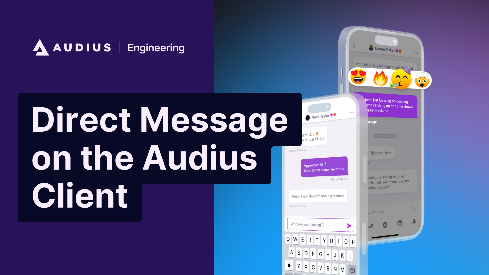

---
authors:
  - audius_eng
  - steve
tags: [engineering]
slug: /direct-messaging-on-the-audius-client
description: Direct Messaging on the Audius Client
image: ./img/social-card.png
date: 2024-09-03T00:00
---

# Direct Messaging on the Audius Client

Last year
[end-to-end encrypted DMs](https://blog.audius.co/article/join-the-conversation-with-direct-messaging-on-audius)
were launched on the Audius client.

For a platform like Audius where data is stored by a decentralized group of Node
Operators, encryption is an essential part of Direct Messages. In this blog post
we’ll take a look at the design and implementation of the feature!

<!--  -->

<!--truncate-->

## Public Keys

Every Audius account has an Ethereum based `secp256k1` private key in their
[Hedgehog wallet](https://hedgehog.audius.org/).  We can use the
[noble crypto](https://github.com/paulmillr/noble-secp256k1?tab=readme-ov-file#getsharedsecret)
`getSharedSecret` function to derive a ECDH shared secret between the two
parties that wish to chat.

Every Audius account has an Ethereum based `secp256k1` private key in their
[Hedgehog wallet](https://hedgehog.audius.org/).  This private key can used in
the
[noble crypto](https://github.com/paulmillr/noble-secp256k1?tab=readme-ov-file#getsharedsecret)
`getSharedSecret` function to derive a shared secret between the two parties
that wish to chat.

> Specifically, we used ECDH shared secrets, read
> [more about ECDH here.](https://en.wikipedia.org/wiki/Elliptic-curve_Diffie%E2%80%93Hellman)

Every Ethereum wallet address for every Audius user is stored on the database
but the address does not represent the full public key for those accounts,
rather the last 20 bytes of the `Keccak-256` hash of the public key.

This is enough to verify signatures via `secp256k1`'s "recover" method, but does
not actually give us the point on the curve.

## Finding Public Keys

The first step to retain the full public key so we can store it to the database
for later was to find a prior transaction from the user.

As we were moving to our own internal EVM-based app chain we used multiple
clients to find historical transactions. After running a backfill we now had the
full public keys for all users, and any two users could arrive at the same
shared secret using their private key and the other user’s public key.

> Asymmetric encryption unlocked!

## Planning for Group Chats

While a simple shared secret would be sufficient for 1:1 DMs, we wanted to keep
the door open for group chats in the future. As such, we introduced an
“invitation” mechanism to layer symmetric encryption atop asymmetric encryption.

To initiate a group chat, the initiator:

- generates a random “chat key”
- encrypts “chat key” for themselves using their private key
- encrypts “chat key” for the other user using the secp256k1 `getSharedSecret`

In this way, the initiator can later use the self-invite and their private key
to decrypt the chat secret needed to read messages. The other party can use
`getSharedSecret` on their end to get the key to decrypt the chat secret. Later,
an existing chat member can encrypt the “chat secret” for a new guest and send
it to them using this invitation mechanism.

> Symmetric encryption unlocked!

## Data Sync

We wanted to explore some different options for syncing data between Nodes in
the network that did not require the gas / fee-payer / contract complexities of
a traditional EVM blockchain. We experimented with a few distributed data
projects like [waku](https://waku.org) and [NATS](https://nats.io).

These projects worked great in development. Things worked in the staging
environment (after some network configuration changes) but when moving to
production there were all kinds of network issues between Nodes that made
configuring the network hard. Different firewalls and proxy configurations
abound, making it hard to use different protocols on different ports.

To overcome these complexities, we opted for a "simplest thing that could
possibly work” approach: A cursor based data sync strategy based on
[http-feeds](https://www.http-feeds.org).

This is the system that powers DMs on Audius today, and we are now looking at
[CometBFT](https://cometbft.com/) for all data sync for the Audius app chain.

## Future

Today, DMs on Audius support decentralized End-to-end encrypted messages, link
unfurling, and purchasing content.The technical foundation that was laid out
when can support multiple other char paradigms to help Artists build a more
intimate and engaged fanbase.

In the Audius community, we have seen many of our users turn towards existing
social & chat platforms to bolster fan growth and retention: Instagram Live,
Discord servers / group messages, SMS text blasts, etc. All of these features
are possible extensions built on the rails of the existing Audius chat system
and ones that Audius endeavors to support.
