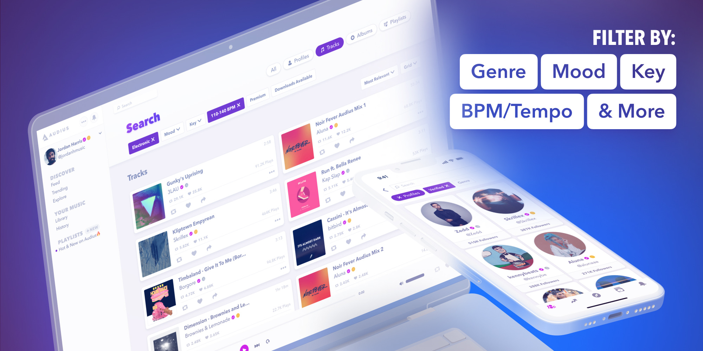

---
authors:
  - audius_eng
  - sebastian
tags: [engineering]
slug: /key-bpm-search-at-audius
description: Key & BPM Search at Audius
image: ./img/social-card.png
date: 2024-08-23T00:00
---

# Key & BPM Search at Audius

We’re excited to introduce the new Advanced Search feature on Audius, which
allows users to refine their searches with filters like genre, mood, key, BPM,
and more, making it easier to discover the vast and diverse Audius catalog.
However, building this feature was far from straightforward, and I’d like to
share some of the technical challenges we faced and how we overcame them.

Since Audius search is powered by Elasticsearch, querying for existing fields
like genre and mood was relatively simple. The primary task here was ensuring
these fields were properly indexed in Elasticsearch, which allowed us to
integrate them into our search queries seamlessly.

<!--truncate-->

The real challenge, however, was analyzing and backfilling BPM and key data for
the entire Audius catalog. This required us to decide on the right analysis
libraries to use, ultimately choosing
[libKeyFinder](https://github.com/mixxxdj/libKeyFinder.git) for detecting
musical key and [Essentia](https://github.com/MTG/essentia.git) for detecting
BPM.

Audius operates with two types of nodes: Content and Discovery. Content nodes
handle receiving, hosting, and serving audio and image content, while Discovery
nodes index this data and expose an API for fetching it. Given this structure,
we opted to perform the audio analysis on the Content nodes during the
transcoding process. This approach centralized the generation of all transcoding
artifacts—MP3s, compressed images, and now key and BPM data—within the same
node.

Once we integrated the analysis libraries, newly uploaded tracks were analyzed
as part of the transcoding process. The results, including key and BPM data,
were returned to the client upon upload and then persisted to Discovery nodes
through our custom ACDC app chain, ensuring the data was indexed and stored
efficiently.

The next major task was to backfill key and BPM data for all existing tracks—a
monumental job given the size of the Audius catalog. We created a job on the
Discovery nodes to fetch the latest data, while the Content nodes performed the
analysis over the course of several weeks.

This backfill process, however, revealed significant weaknesses in our existing
CRUDR system, which is responsible for ensuring consensus between Content nodes.
As the backfill began for over a million tracks, CRUDR struggled under the load,
leading to what we termed a "CRUDR storm." This storm overwhelmed our nodes,
causing the consensus mechanism to fail and resulting in valid data being
overwritten by stale operations.

Initially, the backfill made good progress, but as the system began to degrade,
we saw a sharp decline in completed analyses and a spike in errors. To counter
this, we took several measures: simplifying the audio analysis flow, reducing
CRUDR updates, and implementing targeted code changes to mitigate the impact.
After multiple interventions—including dropping outdated CRUDR records and
advancing sweeper cursors—we finally restored normal operations, allowing the
backfill to progress much more rapidly.

This ordeal underscored the need to replace CRUDR with a more robust solution,
which we plan to implement in the near future.

With the backfill complete, we exposed the new filters via our API and the
[Audius SDK](https://docs.audius.org/sdk/). After finalizing the UI for both web
and mobile, we’re thrilled to offer users much more fine-grained control over
their searches. The ability to filter by key and BPM has already proven
invaluable in helping users discover new and interesting content.
